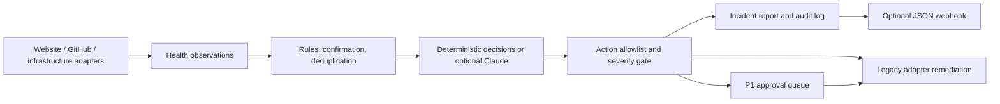

# AI-SRE

**Self-hosted website, GitHub Actions, and Prometheus monitoring, with optional AI incident analysis.**

[](https://github.com/abhay784/AI-SRE/actions/workflows/ci.yml)


A website can return an error, serve the wrong page, or become slow while its
server is still running. A failing CI workflow can also go unnoticed between
deployments. AI-SRE checks these signals, turns persistent failures into
incident reports, and records recovery when checks pass again.

Built by [Abhay Korlapati](https://github.com/abhay784) as a reliability
engineering project focused on asynchronous collectors, deterministic
detection, constrained AI decisions, and an auditable incident pipeline.
The CLI is `ai-sre`; the importable Python package is `ai_sre`.

**Status:** a working self-hosted monitoring MVP for your own sites and
repositories. Website and GitHub monitoring are read-only and need no AI
API key. Hosted accounts, a web dashboard, and customer onboarding are on the
[product roadmap](docs/roadmap.md).

## What works today

| Capability | Behavior |
| --- | --- |
| Website checks | Multiple HTTP(S) URLs, expected status, response time, optional page text, redirects, and TLS verification. |
| GitHub Actions | Selected repositories and branches; discover active workflows or select workflow files. Inspect each workflow's latest completed run and link directly to failures. |
| Prometheus | Run bounded instant PromQL queries against a Prometheus-compatible server and alert on configured numeric thresholds. |
| Incident lifecycle | Confirm consecutive website failures, suppress repeat alerts per target for 30 minutes, and report observed recovery. |
| Reports and alerts | Markdown incident reports, JSONL audit records, and optional JSON incident/recovery webhooks with bounded retries. |
| Optional AI reasoning | Invoke the Claude Agent SDK only after a deterministic rule detects an anomaly; fall back to deterministic decisions if reasoning fails. |
| Remediation framework | Existing Stripe, Postgres, S3, TLS, DNS, email, traffic, deployment, and backup adapters support the original sandbox scenarios. Selected actions require human approval. |

The legacy adapters require their own credentials, infrastructure, or
application-specific endpoints. They are integration examples, not a claim
that every production stack is supported automatically.

## Engineering highlights

- **Separate detection from reasoning.** Healthy polls never invoke the LLM.
  Website and GitHub monitoring can run entirely with deterministic decisions.
- **Constrain execution.** Adapters declare action allowlists. The orchestrator
  enforces them, supports alert-only mode, and queues P1 proposals for human
  approval. The two new monitors expose no remediation actions.
- **Keep monitoring failures visible.** API access errors and failed collectors
  create incidents. A broken integration does not terminate every polling loop.
- **Test behavior at the boundaries.** Regression tests cover HTTP failures,
  GitHub pagination and access errors, independent targets, recovery, webhook
  delivery, and the original remediation pipeline.
- **Preserve evidence.** Reports include detection context and actual action
  outcomes. External notification delivery is audited separately.

## Architecture



Collectors, rules, reasoning, and execution exchange typed Pydantic models.
Website and GitHub checks feed the same incident pipeline as the sandbox
integrations. Recovery records do not require an LLM call.

## Try it in five minutes

Requires Python 3.11+. No Docker, Kubernetes, or AI key is needed for the demo.

```bash
git clone https://github.com/abhay784/AI-SRE.git
cd AI-SRE
python3 -m venv .venv
source .venv/bin/activate
python -m pip install '.[dev]'

# Simulate a website outage and recovery, entirely offline.
python -m examples.demo

# Run the regression suite.
python -m pytest -q
```

The demo prints:

```text
Simulated storefront outage (HTTP 503)
Poll 1: 0 incidents; confirming failure
Poll 2: escalated — storefront: expected HTTP 200, got 503
Poll 3: 0 new incidents; duplicate suppressed
Poll 4: recovered — storefront is healthy again.
```

Open the generated reports in `var/demo/incidents/` to inspect the evidence.

## Monitor your own websites and projects

```bash
cp config/monitoring.example.yaml config/customer.yaml
cp .env.example .env
# Edit config/customer.yaml with your URLs, repository names, and branches.
# Add a GitHub token to .env if needed; see docs/monitoring.md.

# Probe once; exits 1 if any observed check fails. No alerts or fixes are sent.
ai-sre check --config config/customer.yaml

# Start continuous monitoring. Ctrl+C stops the foreground process.
ai-sre run --config config/customer.yaml
```

The example selects deterministic decisions and alert-only mode. A minimal
configuration looks like this:

```yaml
alert_only: true
reasoner: deterministic
integrations:
  website:
    interval: 60
    targets:
      - name: storefront
        url: https://your-site.example/health
        expected_status: 200
        contains: ok
        failure_threshold: 2
  github:
    interval: 300
    repositories:
      - repo: your-account/your-project
        branch: main
        workflows: [ci.yml]
  prometheus:
    url: https://prometheus.example.com
    queries:
      - name: api-error-rate
        query: sum(rate(http_requests_total{job="api",code=~"5.."}[5m])) / sum(rate(http_requests_total{job="api"}[5m]))
        operator: gt
        threshold: 0.05
        severity: P1
```

Remove integrations you do not need. To run continuously in Docker after
editing the configuration:

```bash
docker compose up -d --build
docker compose logs -f monitor
```

Docker stores reports and audit records in a named volume and uses a restart
policy. Run it on an always-on machine outside the site you are monitoring.
See the [monitoring guide](docs/monitoring.md) for authentication, webhook
payloads, operating limits, and optional AI setup.

## Repository guide

| Path | Purpose |
| --- | --- |
| [`ai_sre/adapters/`](ai_sre/adapters/) | Website, GitHub, and infrastructure collectors |
| [`ai_sre/core/`](ai_sre/core/) | Rules, orchestration, reasoning, approvals, reports, and notifications |
| [`config/monitoring.example.yaml`](config/monitoring.example.yaml) | Starting configuration for real websites and repositories |
| [`examples/demo.py`](examples/demo.py) | Reproducible offline outage/recovery demo |
| [`tests/`](tests/) | Unit and pipeline regression tests with test doubles |
| [`sandbox/`](sandbox/) | Local Kubernetes stack and failure injection scripts |
| [`docs/sandbox.md`](docs/sandbox.md) | Original infrastructure demo and remediation walkthrough |
| [`docs/roadmap.md`](docs/roadmap.md) | Steps from self-hosted use to a hosted product |

## Current limits

This release has a CLI and local files, without hosted accounts or a web
dashboard. Confirmation, deduplication, and recovery state live in memory and
reset on restart. Webhook delivery has three attempts without a durable retry
queue. GitHub polling covers Actions outcomes; PR reviews, dependency alerts,
and deployment environments are not yet monitored. HTTP checks do not execute
JavaScript or test checkout flows.

The regression suite uses mocked network services and a simulated infrastructure
pipeline. It does not establish production availability, customer adoption,
or measured improvements in incident response time.
